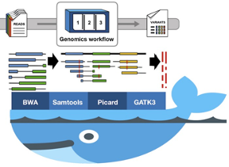

## Implementing genomics workflows using docker

This workflow uses multiple docker images that take *.fastq files and a reference genome file, and create a *.vcf file with a list of variants. Here, I’ll use a test dataset and implement a basic genomics workflow to highlight the use of docker technology in DNA sequence analysis.



Figure 1. Sequence analysis and variant calling workflow using BWA, Samtools, Picard and GATK3 docker images
Datasets:

### Input

7859_GPI.read1.fq and 7859_GPI.read2.fq FASTQ files from GATK google drive folder — tutorial_7859.tar.gz

### Reference sequence
chr19_KI270866v1_alt - two contigs from human GRCh38/hg38: chr19

Download docker images and initiate relevant containers
### BWA
```
> sudo docker pull biocontainers/bwa:v0.7.17–3-deb_cv1
> sudo docker pull biocontainers/bwa

```

### Samtools
```
> sudo docker pull biocontainers/samtools:v1.7.0_cv3
```
### Picard
```
> sudo docker pull biocontainers/picard:v2.3.0_cv3
```

### GATK
#### Download latest GATK release:
```
> sudo docker pull broadinstitute/gatk
```

#### Download a specific GATK release
```
> sudo docker pull quay.io/biocontainers/gatk:3.6–7 ## specific GATK release
```

Run and initiate the gatk_3.6 image and follow GATK3 setup (download a licensed copy of GATK from the Broad Institute and copy GATK into your conda environment)

```
sudo docker run — name gatk_3.6 -it -v <host directory>:/data <IMAGE ID>
sudo docker container exec -it gatk_3.6 bash  ## Follow GATK3 setup
```
#### Run basic steps in a sequence analysis workflow using docker

•	Indexing the reference genome     
Initiate bwa container... and
```
> sudo docker run — name bwa_v0.7.17 -it -v <host directory>:/data <IMAGE ID> bash
```

#### Index the reference
```
> bwa index chr19_KI270866v1_alt.fasta
```
           # Create BWA index with
                     *fasta.amb,
                     *fasta.ann,
                     *fasta.bwt, 
                     *fasta.pac, 
                     *fasta.sa files
                

#### Create *fasta.fai and *dict indexes for GATK analysis
>sudo  docker run — name samtools_v1.7 -it -v <host directory>:/data samtools faidx chr19_KI270866v1_alt.fasta

> sudo docker run -v <host directory>:/data --rm <IMAGE ID> picard CreateSequenceDictionary R=chr19_KI270866v1_alt.fasta O=chr19_KI270866v1_alt.dict

•	Read-mapping using BWA mem
•	Execute BWA container... and
> sudo docker container exec -it bwa_v0.7.17 bashAlign *fq files to the reference> bwa mem -R '@RG\tID:t1\tSM:t1' chr19_KI270866v1_alt.fasta 7859_GPI.read1.fq 7859_GPI.read2.fq > 7859_GPI.aln_pe.sam
  # Created 7859_GPI.aln_pe.sam file
•	Sorting SAM file, marking duplicated reads and indexing BAM files
•	Sort sam file and create a bam file, then index the bam file
>sudo  docker run -v <host directory>:/data --rm <IMAGE ID> picard SortSam INPUT=7859_GPI.aln_pe.sam OUTPUT=7859_GPI.aln_pe.bam SORT_ORDER=coordinate

> sudo docker run -v <host directory>:/data --rm <IMAGE ID> picard BuildBamIndex VALIDATION_STRINGENCY=LENIENT I=7859_GPI.aln_pe.bamMark duplicated reads in the indexed bam file and create a new marked-bam file> docker run -v <host directory>:/data --rm <IMAGE ID> picard MarkDuplicates VALIDATION_STRINGENCY=LENIENT AS=true REMOVE_DUPLICATES=true I=7859_GPI.aln_pe.bam O=7859_GPI.aln_pe.md.bam M=7859_GPI.aln_pe.md.metricsIndex the marked-bam file> docker run -v <host directory>:/data --rm <IMAGE ID> picard BuildBamIndex VALIDATION_STRINGENCY=LENIENT I=7859_GPI.aln_pe.md.bam
•	GATK3 analysis and calling variants

Execute GATK3 container... and
> sudo docker container exec -it gatk_3.6 bashDefine intervals to target for local realignment> java -jar GenomeAnalysisTK.jar -T RealignerTargetCreator \
-nt 4 -R chr19_KI270866v1_alt.fasta -I 7859_GPI.aln_pe.md.bam \
-o 7859_GPI.aln_pe.intervalsPerform local realignment of reads around indels> java -jar GenomeAnalysisTK.jar -T IndelRealigner \
-R chr19_KI270866v1_alt.fasta -I 7859_GPI.aln_pe.md.bam \
-targetIntervals 7859_GPI.aln_pe.intervals -o 7859_GPI.aln_pe.md.bam.realigned.bamCall variants using HaplotypeCaller> java -jar GenomeAnalysisTK.jar -T HaplotypeCaller \
-R chr19_KI270866v1_alt.fasta -ERC GVCF \
-I 7859_GPI.aln_pe.md.bam.realigned.bam -o 7859_GPI.aln_pe.md.bam.realigned.g.vcf

